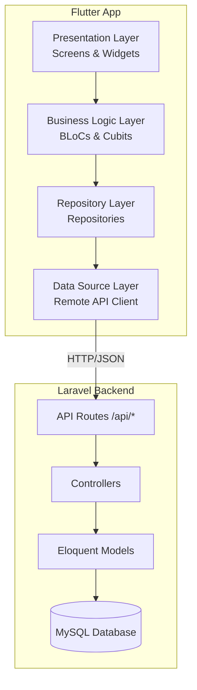
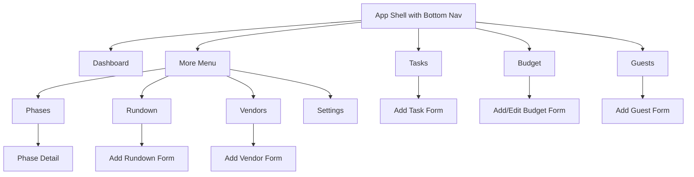
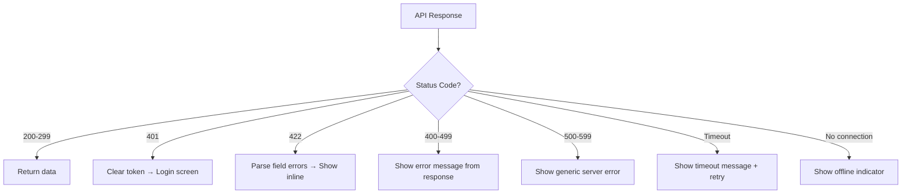

# Design Document: Flutter Wedding Planner App

## Overview

This design describes a Flutter mobile application for Android that connects to the existing Laravel backend to provide comprehensive wedding planning features. The app consumes RESTful JSON API endpoints (to be added to the Laravel backend) and presents data through a neobrutalist UI design system with a white and pink color palette.

The architecture follows a clean separation between presentation, business logic, and data layers using the BLoC (Business Logic Component) pattern with the `flutter_bloc` package. The app communicates with the Laravel API via HTTP, handles authentication with token-based sessions, and provides offline-aware UX feedback.

### Key Design Decisions

1. **State Management: BLoC pattern** — Chosen for its clear separation of concerns, testability, and scalability for a multi-feature app. Each module gets its own BLoC.
2. **API Layer: Dio HTTP client** — Provides interceptors for auth token injection, error handling, and request/response logging out of the box.
3. **Navigation: GoRouter** — Declarative routing with support for nested navigation and bottom nav state preservation.
4. **Backend API Extension** — The existing Laravel backend currently serves web views. New API routes (prefixed `/api/`) returning JSON will be added alongside existing web routes using Laravel API Resources.

## Architecture



### Layer Responsibilities

| Layer | Responsibility | Key Libraries |
|-------|---------------|---------------|
| Presentation | UI rendering, user input, navigation | `flutter`, `go_router` |
| Business Logic | State management, business rules, validation | `flutter_bloc` |
| Repository | Data coordination, caching strategy | — |
| Data Source | HTTP communication, JSON serialization | `dio`, `json_serializable` |

### Dependency Flow

```
UI → BLoC → Repository → DataSource → Laravel API
```

Each layer only depends on the layer directly below it. The Repository layer abstracts the data source, making it possible to swap remote for local data sources during testing.

## Components and Interfaces

### 1. API Client (`ApiClient`)

Central HTTP client wrapping Dio with interceptors.

```dart
class ApiClient {
  final Dio _dio;

  ApiClient({required String baseUrl, required TokenStorage tokenStorage}) {
    _dio = Dio(BaseOptions(baseUrl: baseUrl, connectTimeout: Duration(seconds: 15)));
    _dio.interceptors.add(AuthInterceptor(tokenStorage));
    _dio.interceptors.add(ErrorInterceptor());
  }

  Future<Response> get(String path, {Map<String, dynamic>? queryParams});
  Future<Response> post(String path, {dynamic data});
  Future<Response> put(String path, {dynamic data});
  Future<Response> patch(String path, {dynamic data});
  Future<Response> delete(String path);
}
```

### 2. Authentication Module

```dart
// AuthRepository
abstract class AuthRepository {
  Future<AuthToken> login(String email, String password);
  Future<void> logout();
  Future<AuthToken?> getStoredToken();
  Stream<AuthStatus> get authStatusStream;
}

// AuthBloc states
enum AuthStatus { authenticated, unauthenticated, unknown }
```

### 3. Feature BLoCs

Each feature module follows the same pattern:

```dart
// Example: BudgetBloc
class BudgetBloc extends Bloc<BudgetEvent, BudgetState> {
  final BudgetRepository repository;
  // Events: LoadBudgets, AddBudget, UpdateBudget, DeleteBudget
  // States: BudgetInitial, BudgetLoading, BudgetLoaded, BudgetError
}
```

### 4. Repository Interfaces

| Repository | Methods |
|-----------|---------|
| `DashboardRepository` | `getDashboardData()` |
| `BudgetRepository` | `getAll()`, `create(budget)`, `update(budget)`, `delete(id)` |
| `GuestRepository` | `getAll()`, `create(guest)`, `delete(id)` |
| `PhaseRepository` | `getAll()`, `getDetail(id)` |
| `TaskRepository` | `getAll()`, `create(task)`, `toggleComplete(id)`, `delete(id)` |
| `VendorRepository` | `getAll()`, `create(vendor)`, `delete(id)` |
| `RundownRepository` | `getAll()`, `create(rundown)`, `delete(id)` |
| `SettingsRepository` | `getSettings()`, `updateSettings(settings)` |

### 5. Laravel API Endpoints (New)

The following JSON API endpoints will be added to the Laravel backend:

| Method | Endpoint | Description |
|--------|----------|-------------|
| POST | `/api/login` | Authenticate user, return token |
| POST | `/api/logout` | Invalidate token |
| GET | `/api/dashboard` | Dashboard summary data |
| GET | `/api/budgets` | List all budgets |
| POST | `/api/budgets` | Create budget |
| PUT | `/api/budgets/{id}` | Update budget |
| DELETE | `/api/budgets/{id}` | Delete budget |
| GET | `/api/guests` | List all guests |
| POST | `/api/guests` | Create guest |
| DELETE | `/api/guests/{id}` | Delete guest |
| GET | `/api/phases` | List all phases with progress |
| GET | `/api/phases/{id}` | Phase detail with tasks |
| GET | `/api/tasks` | List all tasks |
| POST | `/api/tasks` | Create task |
| PATCH | `/api/tasks/{id}/toggle` | Toggle task completion |
| DELETE | `/api/tasks/{id}` | Delete task |
| GET | `/api/vendors` | List all vendors |
| POST | `/api/vendors` | Create vendor |
| DELETE | `/api/vendors/{id}` | Delete vendor |
| GET | `/api/rundowns` | List all rundowns |
| POST | `/api/rundowns` | Create rundown |
| DELETE | `/api/rundowns/{id}` | Delete rundown |
| GET | `/api/settings` | Get wedding settings |
| PUT | `/api/settings` | Update wedding settings |

All authenticated endpoints require `Authorization: Bearer {token}` header.

### 6. UI Component Library (Neobrutalist Design System)

```dart
// Core design tokens
class AppTheme {
  static const Color white = Color(0xFFFFFFFF);
  static const Color pink = Color(0xFFFF69B4);
  static const Color lightPink = Color(0xFFFFB6C1);
  static const Color black = Color(0xFF000000);

  static const double borderWidth = 3.0;
  static const double shadowOffset = 4.0;
  static const double borderRadius = 10.0;
}

// Reusable widgets
class NeoCard extends StatelessWidget { ... }
class NeoButton extends StatelessWidget { ... }
class NeoTextField extends StatelessWidget { ... }
class NeoBottomNavBar extends StatelessWidget { ... }
```

### 7. Navigation Structure



## Data Models

### Flutter Models (Dart)

```dart
class Wedding {
  final int id;
  final String groomName;
  final String brideName;
  final DateTime? weddingDate;
  final String? location;
  final double totalBudget;
}

class DashboardData {
  final Wedding wedding;
  final double overallProgress;
  final int totalTasks;
  final int completedTasks;
  final double totalBudget;
  final double totalSpent;
  final int totalGuests;
  final int confirmedGuests;
  final List<Task> upcomingActions;
  final List<Task> pendingInputs;
}

class Budget {
  final int id;
  final String category;
  final double planned;   // maps to 'budget' field in API
  final double actual;
  final double remaining; // computed: planned - actual
  final double percentage; // computed: (actual / planned) * 100
}

class Guest {
  final int id;
  final String name;
  final String side;      // "Pria" | "Wanita" | "Keluarga"
  final String? phone;
  final String? email;
  final String status;
}

class Phase {
  final int id;
  final String name;
  final String? icon;
  final DateTime? startDate;
  final DateTime? endDate;
  final int order;
  final double progress;
  final int completedTasks;
  final int totalTasks;
}

class Task {
  final int id;
  final int phaseId;
  final String title;
  final String? description;
  final String type;       // "input" | "execution"
  final String category;
  final String priority;   // "rendah" | "sedang" | "tinggi"
  final DateTime? dueDate;
  final bool completed;
  final DateTime? completedAt;
  final int order;
  final String? notes;
}

class Vendor {
  final int id;
  final String name;
  final String category;
  final String? phone;
  final String? email;
  final double cost;
  final String? status;
}

class Rundown {
  final int id;
  final String name;
  final String time;
  final String? location;
  final String? pic;
  final String? notes;
}

class AuthToken {
  final String accessToken;
  final String tokenType;
}
```

### JSON Serialization

All models use `json_serializable` with `@JsonSerializable()` annotations for automatic `fromJson`/`toJson` generation. Field name mapping uses `@JsonKey(name: 'field_name')` for snake_case to camelCase conversion.

### API Response Envelope

```json
{
  "success": true,
  "data": { ... },
  "message": "Optional message"
}
```

Error responses:
```json
{
  "success": false,
  "message": "Error description",
  "errors": { "field": ["Validation error"] }
}
```

## Correctness Properties

*A property is a characteristic or behavior that should hold true across all valid executions of a system — essentially, a formal statement about what the system should do. Properties serve as the bridge between human-readable specifications and machine-verifiable correctness guarantees.*

### Property 1: Model serialization round-trip

*For any* valid model instance (Budget, Guest, Task, Vendor, Rundown, Wedding), serializing to JSON via `toJson()` and then deserializing back via `fromJson()` shall produce an object equal to the original.

**Validates: Requirements 1.1**

### Property 2: HTTP error code to user-friendly message mapping

*For any* HTTP error status code in the range 400–599, the error interceptor shall produce a non-empty, user-friendly error message string that does not expose raw technical details.

**Validates: Requirements 1.3**

### Property 3: Auth token injection on authenticated requests

*For any* API request path that requires authentication, the auth interceptor shall include a non-empty `Authorization: Bearer {token}` header when a valid token is stored.

**Validates: Requirements 1.5**

### Property 4: Derived numeric computations are correct

*For any* pair of non-negative numbers (planned, actual) where planned > 0, the budget remaining shall equal `planned - actual` and the percentage shall equal `round((actual / planned) * 100, 1)`. For any pair (completedTasks, totalTasks) where totalTasks > 0, progress percentage shall equal `round((completedTasks / totalTasks) * 100, 1)` and be bounded between 0 and 100.

**Validates: Requirements 3.2, 4.1**

### Property 5: Budget total aggregation

*For any* list of budget items, the displayed total planned shall equal the sum of all individual planned amounts, and the displayed total actual shall equal the sum of all individual actual amounts.

**Validates: Requirements 4.2**

### Property 6: Guest count filtering

*For any* list of guests with various status values, the total count shall equal the list length, the confirmed count shall equal the number of guests with status in ["Konfirmasi", "Hadir"], and the pending count shall equal the number of guests with status in ["Belum Diundang", "Diundang"].

**Validates: Requirements 5.2**

### Property 7: Form validation rejects invalid input and accepts valid input

*For any* string composed entirely of whitespace or empty, form validators for required fields (budget category, guest name, task title, vendor name, vendor category, rundown name, rundown time, groom name, bride name) shall reject the input. *For any* non-empty, non-whitespace-only string, these validators shall accept the input. *For any* side value not in the set {"Pria", "Wanita", "Keluarga"}, the guest side validator shall reject it. *For any* non-numeric string or negative number, the budget amount validator shall reject it.

**Validates: Requirements 4.6, 5.5, 7.7, 8.4, 9.4, 10.3**

### Property 8: Overdue task detection

*For any* task where `completed` is false and `dueDate` is before the current date, the task shall be flagged as overdue. *For any* task where `completed` is true OR `dueDate` is today or in the future, the task shall NOT be flagged as overdue.

**Validates: Requirements 7.6**

## Error Handling

### Network Errors

| Scenario | Behavior |
|----------|----------|
| No connectivity | Show offline banner, disable form submissions, allow viewing cached data if available |
| Request timeout (>15s) | Show timeout error message, offer retry |
| Server error (5xx) | Show generic "Server error, please try again" message |
| Client error (4xx) | Show specific error message from API response |
| Token expired (401) | Clear token, redirect to login screen |
| Validation error (422) | Show field-specific error messages below form inputs |

### Error Interceptor Flow



### Optimistic vs. Pessimistic Updates

- **Toggle task completion**: Optimistic update (update UI immediately, revert on failure)
- **Create/Delete operations**: Pessimistic (show loading, update UI after API confirms)
- **Settings update**: Pessimistic with loading indicator

## Testing Strategy

### Unit Tests

Unit tests cover specific examples, edge cases, and component behavior:

- **Widget tests**: Verify UI rendering for each screen (correct widgets, text, layout)
- **BLoC tests**: Verify state transitions for each event (loading → loaded, loading → error)
- **Repository tests**: Verify correct API calls are made with mocked Dio client
- **Error handling tests**: Verify specific error scenarios (401 redirect, 422 field errors)
- **Navigation tests**: Verify routing and tab state preservation

### Property-Based Tests

Property-based tests verify universal properties across generated inputs using the `dart_check` package (or `glados` for Dart PBT):

- **Minimum 100 iterations** per property test
- Each test references its design document property via tag comment
- Tag format: `// Feature: flutter-wedding-planner-app, Property {number}: {property_text}`

Properties to implement:
1. Model serialization round-trip (all 7 model classes)
2. HTTP error code mapping (codes 400-599)
3. Auth token injection (random paths)
4. Derived numeric computations (percentage, remaining)
5. Budget total aggregation (random budget lists)
6. Guest count filtering (random guest lists with statuses)
7. Form validation (random strings, numbers, enum values)
8. Overdue task detection (random dates and completion states)

### Integration Tests

Integration tests verify end-to-end flows with mocked API:

- Login flow (valid/invalid credentials)
- CRUD operations for each module (create, read, update, delete)
- Pull-to-refresh behavior
- Offline/online state transitions

### Test Organization

```
test/
├── unit/
│   ├── blocs/          # BLoC state transition tests
│   ├── models/         # Model serialization tests
│   ├── repositories/   # Repository method tests
│   └── validators/     # Form validation tests
├── property/
│   ├── serialization_test.dart
│   ├── error_mapping_test.dart
│   ├── auth_interceptor_test.dart
│   ├── computations_test.dart
│   ├── guest_counts_test.dart
│   ├── validation_test.dart
│   └── overdue_detection_test.dart
├── widget/
│   ├── screens/        # Screen widget tests
│   └── components/     # Reusable widget tests
└── integration/
    └── flows/          # End-to-end flow tests
```

