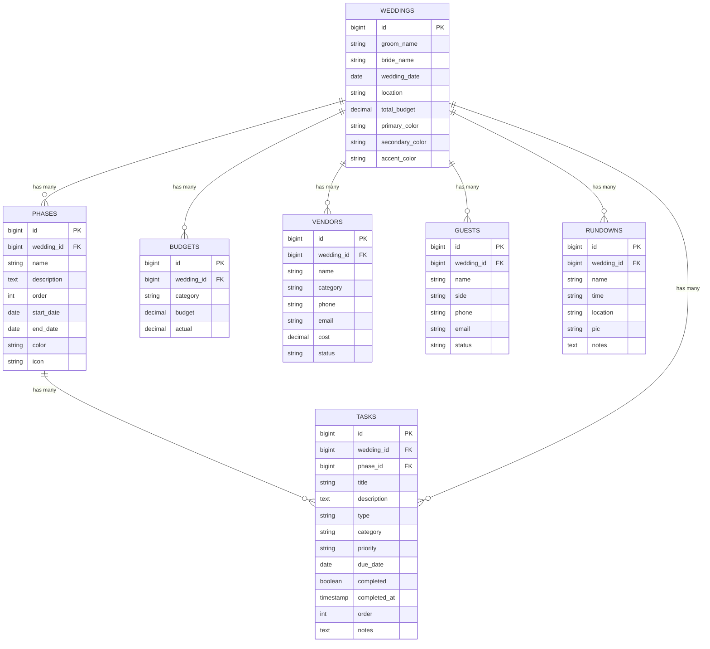

# 💍 Dokumentasi Fitur & Struktur Tabel - Wedding Planner GAS

Dokumentasi lengkap mengenai fitur-fitur aplikasi, struktur basis data, skema tabel, serta relasi data pada project **Wedding Planner**.

---

## 📌 Ringkasan Project & Arsitektur

Project ini merupakan platform perencanaan pernikahan terpadu yang dirancang dengan fleksibilitas tinggi:
1. **Frontend / Standalone Web App:** Berbasis HTML5, CSS3, dan Vanilla JavaScript (dengan penyimpanan Local Storage browser & export/import JSON).
2. **Backend API & Web App (Laravel):** Berbasis Laravel (PHP 8+) dengan database SQLite / MySQL dan arsitektur MVC.
3. **Google Apps Script (GAS) & Sheets Sync:** Script integrasi Google Sheets (`GAS_Code.gs`, `Kode Warna.gs`, `GAS_Index.html`) untuk sinkronisasi data dan generator palet warna tema.

---

## 🎯 Daftar Fitur Lengkap

### 1. 📊 Dashboard & Monitoring
* **Ringkasan Pasangan:** Menampilkan nama pengantin pria & wanita, tanggal pernikahan, lokasi venue, dan countdown hari-H.
* **Statistik Real-Time:** 
  - Total Anggaran vs Pengeluaran Aktual.
  - Sisa Anggaran (Remaining Budget).
  - Total Tamu & Status Konfirmasi Kehadiran.
  - Progress persiapan (persentase task selesai).
* **Live Theme Preview:** Menampilkan palet warna tema yang sedang aktif.

### 2. 🎨 Moodboard & Sistem Warna Tema
* **Palette Generator:** Pemilihan warna utama (*Primary*), sekunder (*Secondary*), dan aksen (*Accent*).
* **Dynamic Theming:** Perubahan warna tema langsung diterapkan ke seluruh elemen UI (header, button, badge, progress bar) secara realtime.
* **Visual Moodboard:** Galeri foto & inspirasi visual untuk dekorasi, busana, venue, dan konsep pernikahan.

### 3. 💰 Budgeting & Tracking Pengeluaran
* **Kategori Biaya:** Pengelompokan budget berdasarkan kategori (Catering, Dekorasi, Venue, Fotografi, Busana, MUA, Undangan, dll).
* **Estimasi vs Aktual:** Input alokasi budget dan pencatatan pengeluaran riil per kategori.
* **Kalkulasi Otomatis:** Perhitungan selisih (surplus/defisit) dan persentase utilisasi budget.

### 4. 🤝 Vendor Management
* **Database Vendor:** Pencatatan vendor lengkap berdasarkan kategori layanan.
* **Kontak & Komunikasi:** Menyimpan nomor telepon (WhatsApp), email, dan PIC vendor.
* **Tracking Biaya Vendor:** Pencatatan nilai kontrak/tagihan per vendor.
* **Status Vendor:** Status kerja sama (misal: *Aktif*, *Pending*, *Lunas*).

### 5. 📋 To-Do List & Timeline Persiapan (Phases & Tasks)
* **Fase Persiapan (*Phases*):** Pengelompokan task berdasarkan rentang waktu (misal: *H-6 Bulan*, *H-3 Bulan*, *H-1 Bulan*, *Hari-H*).
* **Manajemen Task:**
  - Kategori task & prioritas (*Rendah*, *Sedang*, *Tinggi*).
  - Tipe task (*Input Data* atau *Eksekusi Lapangan*).
  - Target tenggat waktu (*Due Date*).
  - Checkbox penyelesaian task dengan pencatatan otomatis timestamp `completed_at`.
  - Sorting otomatis berdasarkan tanggal & prioritas.

### 6. ✉️ Manajemen Tamu & Undangan (*Guest List & RSVP*)
* **Pengelompokan Pihak:** Klasifikasi tamu berdasarkan pihak (*Keluarga*, *Pria*, *Wanita*).
* **Tracking Status Undangan & RSVP:**
  - `Belum Diundang`
  - `Diundang`
  - `Konfirmasi`
  - `Hadir`
  - `Tidak Hadir`
* **Informasi Kontak:** Nomor HP/WhatsApp dan email untuk pengiriman undangan digital.
* **Statistik Tamu:** Total tamu terdaftar, jumlah konfirmasi hadir, dan persentase kehadiran.

### 7. ⏰ Rundown Acara (Timeline Hari-H)
* **Jadwal Kegiatan:** Penyusunan timeline detik demi detik hari pernikahan (Akad/Pemberkatan, Resepsi, Foto Sesi, Ramah Tamah).
* **Alokasi PIC & Lokasi:** Penetapan Person In Charge (penanggung jawab) dan lokasi spesifik per sesi acara.
* **Catatan Khusus:** Instruksi detail untuk tim WO (Wedding Organizer) dan keluarga.
* **Sorting Kronologis:** Pengurutan otomatis berdasarkan waktu pelaksanaan.

### 8. ⚙️ Pengaturan & Manajemen Data
* **Konfigurasi Pernikahan:** Edit nama pengantin, tanggal, venue, dan target budget total.
* **Data Backup (JSON):** Export semua data ke file JSON untuk backup lokal.
* **Data Restore (JSON):** Import data dari file backup JSON.
* **Reset Data:** Fitur pengosongan data dengan konfirmasi keamanan.
* **Print Template:** Template siap cetak untuk ringkasan rundown dan daftar tugas.

---

## 🗄️ Struktur Tabel Database (Laravel Backend)

Database menggunakan relasi relasional dengan tabel `weddings` sebagai entitas induk utama.

### 1. Tabel `weddings`
Menyimpan data profil pernikahan dan preferensi warna tema.

| Kolom | Tipe Data | Nullable | Default | Keterangan |
|-------|-----------|:--------:|:-------:|------------|
| `id` | `BIGINT UNSIGNED` | ❌ | `AUTO_INCREMENT` | Primary Key |
| `groom_name` | `VARCHAR(255)` | ❌ | `''` | Nama pengantin pria |
| `bride_name` | `VARCHAR(255)` | ❌ | `''` | Nama pengantin wanita |
| `wedding_date` | `DATE` | ✔️ | `NULL` | Tanggal pelaksanaan pernikahan |
| `location` | `VARCHAR(255)` | ❌ | `''` | Lokasi / Venue pernikahan |
| `total_budget` | `DECIMAL(15,2)` | ❌ | `0.00` | Target total anggaran |
| `primary_color` | `VARCHAR(255)` | ❌ | `'#FF69B4'` | Hex code warna utama tema |
| `secondary_color` | `VARCHAR(255)` | ❌ | `'#FFB6C1'` | Hex code warna sekunder |
| `accent_color` | `VARCHAR(255)` | ❌ | `'#FFD700'` | Hex code warna aksen |
| `created_at` | `TIMESTAMP` | ✔️ | `NULL` | Waktu dibuat |
| `updated_at` | `TIMESTAMP` | ✔️ | `NULL` | Waktu diperbarui |

---

### 2. Tabel `phases`
Menyimpan tahapan/fase waktu persiapan pernikahan.

| Kolom | Tipe Data | Nullable | Default | Keterangan |
|-------|-----------|:--------:|:-------:|------------|
| `id` | `BIGINT UNSIGNED` | ❌ | `AUTO_INCREMENT` | Primary Key |
| `wedding_id` | `BIGINT UNSIGNED` | ❌ | - | Foreign Key -> `weddings.id` (Cascade) |
| `name` | `VARCHAR(255)` | ❌ | - | Nama fase (misal: "Persiapan 6 Bulan") |
| `description` | `TEXT` | ✔️ | `NULL` | Keterangan fase |
| `order` | `INT` | ❌ | `0` | Urutan penayangan fase |
| `start_date` | `DATE` | ✔️ | `NULL` | Tanggal awal fase |
| `end_date` | `DATE` | ✔️ | `NULL` | Tanggal akhir fase |
| `color` | `VARCHAR(255)` | ❌ | `'#FF69B4'` | Warna penanda fase |
| `icon` | `VARCHAR(255)` | ❌ | `'📋'` | Emoji / Icon penanda fase |
| `created_at` | `TIMESTAMP` | ✔️ | `NULL` | Waktu dibuat |
| `updated_at` | `TIMESTAMP` | ✔️ | `NULL` | Waktu diperbarui |

---

### 3. Tabel `tasks`
Menyimpan daftar pekerjaan / to-do list persiapan.

| Kolom | Tipe Data | Nullable | Default | Keterangan |
|-------|-----------|:--------:|:-------:|------------|
| `id` | `BIGINT UNSIGNED` | ❌ | `AUTO_INCREMENT` | Primary Key |
| `wedding_id` | `BIGINT UNSIGNED` | ❌ | - | Foreign Key -> `weddings.id` (Cascade) |
| `phase_id` | `BIGINT UNSIGNED` | ❌ | - | Foreign Key -> `phases.id` (Cascade) |
| `title` | `VARCHAR(255)` | ❌ | - | Judul tugas |
| `description` | `TEXT` | ✔️ | `NULL` | Deskripsi detail tugas |
| `type` | `VARCHAR(255)` | ❌ | `'input'` | Tipe tugas (`input` / `execution`) |
| `category` | `VARCHAR(255)` | ❌ | `'Persiapan'` | Kategori tugas |
| `priority` | `VARCHAR(255)` | ❌ | `'sedang'` | Prioritas (`rendah`, `sedang`, `tinggi`) |
| `due_date` | `DATE` | ✔️ | `NULL` | Batas akhir pengerjaan |
| `completed` | `BOOLEAN` | ❌ | `false` | Status selesai |
| `completed_at` | `TIMESTAMP` | ✔️ | `NULL` | Waktu tugas diselesaikan |
| `order` | `INT` | ❌ | `0` | Urutan tugas |
| `notes` | `TEXT` | ✔️ | `NULL` | Catatan tambahan |
| `created_at` | `TIMESTAMP` | ✔️ | `NULL` | Waktu dibuat |
| `updated_at` | `TIMESTAMP` | ✔️ | `NULL` | Waktu diperbarui |

---

### 4. Tabel `budgets`
Menyimpan rincian anggaran dan pengeluaran aktual per kategori.

| Kolom | Tipe Data | Nullable | Default | Keterangan |
|-------|-----------|:--------:|:-------:|------------|
| `id` | `BIGINT UNSIGNED` | ❌ | `AUTO_INCREMENT` | Primary Key |
| `wedding_id` | `BIGINT UNSIGNED` | ❌ | - | Foreign Key -> `weddings.id` (Cascade) |
| `category` | `VARCHAR(255)` | ❌ | - | Nama kategori biaya |
| `budget` | `DECIMAL(15,2)` | ❌ | `0.00` | Alokasi dana yang dianggarkan |
| `actual` | `DECIMAL(15,2)` | ❌ | `0.00` | Biaya riil yang dikeluarkan |
| `created_at` | `TIMESTAMP` | ✔️ | `NULL` | Waktu dibuat |
| `updated_at` | `TIMESTAMP` | ✔️ | `NULL` | Waktu diperbarui |

---

### 5. Tabel `vendors`
Menyimpan data vendor dan status kerjasama.

| Kolom | Tipe Data | Nullable | Default | Keterangan |
|-------|-----------|:--------:|:-------:|------------|
| `id` | `BIGINT UNSIGNED` | ❌ | `AUTO_INCREMENT` | Primary Key |
| `wedding_id` | `BIGINT UNSIGNED` | ❌ | - | Foreign Key -> `weddings.id` (Cascade) |
| `name` | `VARCHAR(255)` | ❌ | - | Nama vendor |
| `category` | `VARCHAR(255)` | ❌ | - | Kategori layanan |
| `phone` | `VARCHAR(255)` | ❌ | `''` | Nomor telepon vendor |
| `email` | `VARCHAR(255)` | ❌ | `''` | Email vendor |
| `cost` | `DECIMAL(15,2)` | ❌ | `0.00` | Nilai kontrak / biaya |
| `status` | `VARCHAR(255)` | ❌ | `'Aktif'` | Status vendor |
| `created_at` | `TIMESTAMP` | ✔️ | `NULL` | Waktu dibuat |
| `updated_at` | `TIMESTAMP` | ✔️ | `NULL` | Waktu diperbarui |

---

### 6. Tabel `guests`
Menyimpan daftar tamu undangan dan status RSVP.

| Kolom | Tipe Data | Nullable | Default | Keterangan |
|-------|-----------|:--------:|:-------:|------------|
| `id` | `BIGINT UNSIGNED` | ❌ | `AUTO_INCREMENT` | Primary Key |
| `wedding_id` | `BIGINT UNSIGNED` | ❌ | - | Foreign Key -> `weddings.id` (Cascade) |
| `name` | `VARCHAR(255)` | ❌ | - | Nama tamu undangan |
| `side` | `VARCHAR(255)` | ❌ | `'Keluarga'` | Pihak pengundang (`Pria`, `Wanita`, `Keluarga`) |
| `phone` | `VARCHAR(255)` | ❌ | `''` | Nomor telepon / WhatsApp |
| `email` | `VARCHAR(255)` | ❌ | `''` | Email tamu |
| `status` | `VARCHAR(255)` | ❌ | `'Belum Diundang'` | Status undangan & konfirmasi |
| `created_at` | `TIMESTAMP` | ✔️ | `NULL` | Waktu dibuat |
| `updated_at` | `TIMESTAMP` | ✔️ | `NULL` | Waktu diperbarui |

---

### 7. Tabel `rundowns`
Menyimpan jadwal susunan acara hari-H.

| Kolom | Tipe Data | Nullable | Default | Keterangan |
|-------|-----------|:--------:|:-------:|------------|
| `id` | `BIGINT UNSIGNED` | ❌ | `AUTO_INCREMENT` | Primary Key |
| `wedding_id` | `BIGINT UNSIGNED` | ❌ | - | Foreign Key -> `weddings.id` (Cascade) |
| `name` | `VARCHAR(255)` | ❌ | - | Nama sesi / agenda acara |
| `time` | `VARCHAR(255)` | ❌ | - | Waktu / Jam kegiatan |
| `location` | `VARCHAR(255)` | ❌ | `''` | Lokasi / Ruangan |
| `pic` | `VARCHAR(255)` | ❌ | `''` | Penanggung jawab (PIC) |
| `notes` | `TEXT` | ✔️ | `NULL` | Catatan teknis acara |
| `created_at` | `TIMESTAMP` | ✔️ | `NULL` | Waktu dibuat |
| `updated_at` | `TIMESTAMP` | ✔️ | `NULL` | Waktu diperbarui |

---

## 🔗 Diagram Relasi Entitas (ERD)



---

## 🔄 Format Sinkronisasi Data (JSON Schema)

Aplikasi standalone maupun Google Apps Script menggunakan struktur JSON terpadu berikut saat export/import data:

```json
{
  "wedding": {
    "groom_name": "Rizki",
    "bride_name": "Arta",
    "wedding_date": "2026-12-12",
    "location": "Grand Ballroom Hotel",
    "total_budget": 150000000,
    "primary_color": "#FF69B4",
    "secondary_color": "#FFB6C1",
    "accent_color": "#FFD700"
  },
  "phases": [],
  "tasks": [],
  "budgets": [],
  "vendors": [],
  "guests": [],
  "rundowns": []
}
```
